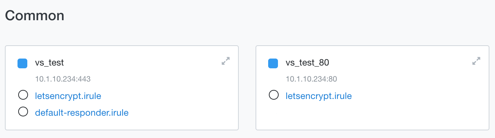

# F5 BIG-IP and Let's Encrypt

As many of my customers ask me how to integrate BIG-IP with Let's Encrypt in order to automate issuing of SSL/TLS Certs. I decided to put all my notes from the procedure here.

This document is based on this [article](https://wiki.lnxgeek.org/doku.php/howtos:let_s_encrypt_-_how_to_issue_certificates_from_a_bigip) and all kudos 🙏🏻 should go to the original author.

## Links
- [Let's Encrypt on a BigIP](https://wiki.lnxgeek.org/doku.php/howtos:let_s_encrypt_-_how_to_issue_certificates_from_a_bigip)
- [GitHub - dehydrated-io/dehydrated](https://github.com/dehydrated-io/dehydrated)

## How-to

### Location
It's recommended to store all the related files and scripts in `/shared` folder as this one is preserved across different boot partitions. Create the following directories:
```bash
mkdir /shared/letsencrypt
mkdir /shared/letsencrypt/.acme-challenges
```
Then you can put content of `./letsencrypt/` folder from this repository to your `/shared/letsencrypt` folder on your BIG-IP.

### DataGroup
Create DG for storing acme responses.
```
tmsh create ltm data-group internal acme_responses type string
```

### iRule
Attach [iRule](./letsencrypt.irule) to a VS catching traffic for that particular domain. Where you want to add the cert from Let's Encrypt.



> It should be enough to have `letsencrypt.irule` attached only to HTTP based VS. However if your HTTP VS returns only HTTP Redirect to an HTTPS VS, you should attach the iRule there. You can find more details on it [here](https://letsencrypt.org/docs/challenge-types/#http-01-challenge).

### Client SSL Profile
The clientSSL profile must be in this format: `auto_${DOMAIN}`. The following script [domains.sh](./letsencrypt/domains.sh) creates those profiles based on the values in `domains.txt` file.

```bash
#!/bin/bash
for I in $( cat domains.txt | awk '{ print $1}' ); do
    tmsh create ltm profile client-ssl auto_$I defaults-from letsencrypt
  echo "Created  auto_$I client-ssl profile"
done
```

> It's recommended to create a parent profile which contains the required configuration options and refer to this parent profile while creating `auto_` profiles.
> I have created client-ssl profile named `letsencrypt` and then modified the script above to: `tmsh create ltm profile client-ssl auto_$I defaults-from letsencrypt`

**domains.txt**
```
example.com www.example.com
example.dk wiki.example.dk
example.se upload.example.se download.example.se
```
Please customize this file and add your domains. Also please make sure, that the external clients can resolve domains from this file.

You have to run `./domains.sh` script before you continue with this how-to and then every-time you modify `domains.txt` file.

### hook.sh
This [script](./letsencrypt/hook.sh) just manage the F5 configuration, it's ok to use it in default configuration. No need to change it, unless you need some extra features.

> Seems that the `tmsh` commands used in this script are not valid for TMOS v12.1. If it is your case, please use [hook-v12-1.sh](./letsencrypt/hook-v12-1.sh). Don't forget to rename it to `hook.sh` before using it.

### config
The main [configuration file](./letsencrypt/config). As I was ok with most of the default configuration as I moved all the files to `/shared/letsencrypt` and I had to only remove comment from the following line:  
```bash
WELLKNOWN="${BASEDIR}/.acme-challenges"
```
> Prior to BIG-IP 14.1.0, you must have an RSA certificate/key pair assigned to an SSL profile. You can only associate other algorithms such as DSA/ECDSA on top of the RSA certificate/key pair assignment. If it is your case, please use this config option `KEY_ALGO=rsa`.

### dehydrated
Please [download](https://github.com/dehydrated-io/dehydrated) dehydrated ACME client from GitHub.

### wrapper.sh
In production, run [wrapper.sh](./letsencrypt/wrapper.sh) instead of `dehydrated`. The `wrapper.sh` makes sure, that it runs on the active BIG-IP (in case of HA cluster) only, also it creates logs and can send you email notification. Please review the configuration options and adjust accordingly:
```bash
MAILRCPT="example@example.com"
MAILFROM="f5@example"
MAILSERVER="mail.example.com"
MAILSERVERPORT="25"
LOGFILE="/var/log/letsencrypt.log"
DATE=$(date)
SENDMAIL="/shared/letsencrypt/send_mail"
MAILFILE="/var/tmp/mail.txt"
date >$LOGFILE 2>&1
echo "" > $MAILFILE
```

Compared to the original script, I commented out the line `cd /shared/scripts` as all the files resides in `/shared/letsencrypt`

Also don't forget to include the [send_mail](./letsencrypt/send_mail) in your `/shared/letsencrypt` folder. It's being used to sending out email notifications.

### iCall
Create the iCall configuration to renew your certificates automatically.
```
tmsh create sys icall script letsencrypt
tmsh modify sys icall script letsencrypt definition { exec /shared/letsencrypt/wrapper.sh }
tmsh create sys icall handler periodic letsencrypt first-occurrence 2017-07-21:00:00:00 interval 604800 script letsencrypt
tmsh save sys config
```

### Run dehydrated and test 🎉
At this point, your `/shared/letsencrypt` folder should look like this one:
```
[root@bigipA:Active:Standalone] letsencrypt # ls -la
total 140
drwxr-xr-x.  6 root root  4096 May  2 21:28 .
drwxr-xr-x. 30 root root  4096 Apr 30 05:23 ..
drwxr-xr-x.  2 root root  4096 Apr 30 08:42 .acme-challenges
-rw-r--r--.  1 root root  3522 May  2 21:28 config
-rwxr-xr-x.  1 root root 83678 Apr 30 05:14 dehydrated
-rwxr-xr-x.  1 root root   187 Apr 30 05:12 domains.sh
-rw-r--r--.  1 root root    22 Apr 30 05:07 domains.txt
-rwxr-xr-x.  1 root root  8266 Apr 30 05:16 hook.sh
-rwxr-xr-x.  1 root root  2078 Apr 30 05:17 send_mail
-rwxr-xr-x.  1 root root   812 Apr 30 05:24 wrapper.sh
[root@bigipA:Active:Standalone] letsencrypt #
```

Please make sure that the relevant scripts have the `+x` flag enabled.

Now, you should be able to run `dehydrated` and to see if it works correctly.
```bash
cd /shared/letsencrypt
./dehydrated -c
```

On a few systems, I noticed that the `curl` refused to connect:
```
[root@bigipA:Active:Standalone] letsencrypt # ./dehydrated -c
# INFO: Using main config file /shared/letsencrypt/config
ERROR: Problem connecting to server (get for https://acme-v02.api.letsencrypt.org/directory; curl returned with 60)
EXPECTED value GOT EOF
[root@bigipA:Active:Standalone] letsencrypt #
```

In this case it's required to update the CA Bundle:
```bash
rm /etc/pki/tls/certs/ca-bundle.crt
curl -k https://curl.se/ca/cacert.pem -o /etc/pki/tls/certs/ca-bundle.crt
```

> In case of connection failure, please double-check your DNS configuration. Which is the most common issue.

Next... very likely `dehydrated` response will be:
```bash
[root@bigipA:Active:Standalone] letsencrypt # ./dehydrated -c
# INFO: Using main config file /shared/letsencrypt/config

To use dehydrated with this certificate authority you have to agree to their terms of service which you can find here: https://letsencrypt.org/documents/LE-SA-v1.2-November-15-2017.pdf

To accept these terms of service run `./dehydrated --register --accept-terms`.
[root@bigipA:Active:Standalone] letsencrypt # ./dehydrated --register --accept-terms
```

So please read and then agree with the terms of service by running: `./dehydrated --register --accept-terms` and finally continue with `./dehydrated -c`.

You should see the whole procedure and then find your certificate here:
```
[root@bigipA:Active:Standalone] letsencrypt # ll certs/
total 4
drwx------. 2 root root 4096 Apr 30 08:42 homeoffice.f5demo.app
[root@bigipA:Active:Standalone] letsencrypt # ll certs/homeoffice.f5demo.app/
total 28
-rw-------. 1 root root  525 Apr 30 06:28 cert-1619756884.csr
-rw-------. 1 root root    0 Apr 30 06:28 cert-1619756884.pem
-rw-------. 1 root root  525 Apr 30 08:42 cert-1619764954.csr
-rw-------. 1 root root 1623 Apr 30 08:42 cert-1619764954.pem
lrwxrwxrwx. 1 root root   19 Apr 30 08:42 cert.csr -> cert-1619764954.csr
lrwxrwxrwx. 1 root root   19 Apr 30 08:42 cert.pem -> cert-1619764954.pem
-rw-------. 1 root root 1587 Apr 30 08:42 chain-1619764954.pem
lrwxrwxrwx. 1 root root   20 Apr 30 08:42 chain.pem -> chain-1619764954.pem
-rw-------. 1 root root 3210 Apr 30 08:42 fullchain-1619764954.pem
lrwxrwxrwx. 1 root root   24 Apr 30 08:42 fullchain.pem -> fullchain-1619764954.pem
-rw-------. 1 root root  359 Apr 30 06:28 privkey-1619756884.pem
-rw-------. 1 root root  359 Apr 30 08:42 privkey-1619764954.pem
lrwxrwxrwx. 1 root root   22 Apr 30 08:42 privkey.pem -> privkey-1619764954.pem
```

Also the client-ssl profile should be created:
```
[root@bigipA:Active:Standalone] letsencrypt # tmsh list ltm profile client-ssl auto_homeoffice.f5demo.app
ltm profile client-ssl auto_homeoffice.f5demo.app {
    app-service none
    cert-key-chain {
        default {
            cert homeoffice.f5demo.app_2021-04-30
            key homeoffice.f5demo.app_2021-04-30
        }
    }
    defaults-from letsencrypt
    inherit-ca-certkeychain true
    inherit-certkeychain false
}
[root@bigipA:Active:Standalone] letsencrypt #
```

Don't forget to attach your client-ssl profile to particular VS!

## Disclaimer
This how-to is provided as is. Use it at your own responsibility.
